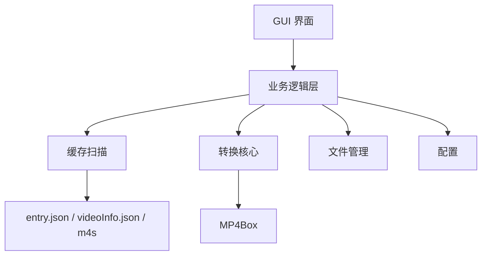

# 基于GPAC MP4Box的B站缓存视频无损转换工具（macOS）  
## 技术框架与需求描述

---

## 1. 引言

Bilibili macOS客户端下载的视频采用MPEG-DASH流媒体技术，将音视频分离为多个`.m4s`片段文件存储。为了在本地播放器（如IINA、QuickTime）中方便观看，需要将这些片段无损封装为标准MP4文件。现有工具多基于FFmpeg实现，但存在偶发的音画同步问题。**GPAC MP4Box**作为专业的多媒体打包工具，在MP4复用方面具有更高的可控性和稳定性。参考开源项目`m4s-converter`的设计思路，本工具旨在为macOS平台提供一款界面友好、高效无损的B站缓存视频转换工具，核心转换模块采用MP4Box，确保音视频完美同步且画质无损。

---

## 2. 总体技术框架

### 2.1 架构概览

工具采用**轻量化单体架构**：单一进程、单一 `.app`，GUI 与业务逻辑内聚运行，无独立服务端、无 RPC、无重量级框架。目标为本地即开即用的小工具。



### 2.2 设计原则

- **单体应用**：GUI 与 Rust 后端同一进程，通过 Tauri Commands 直接调用，无网络、无进程间通信
- **本地运行**：仅操作本地文件，无云端、无账号
- **轻量依赖**：Rust 标准库 + serde + Tauri + MP4Box，无 gRPC、无数据库
- **即开即用**：双击启动，关闭即退出，无后台常驻

### 2.3 模块职责

| 模块 | 职责 |
|------|------|
| **缓存扫描与解析** | 定位 B 站缓存目录，遍历子文件夹，解析 `entry.json` 或 `videoInfo.json`，定位音视频 m4s 文件 |
| **转换核心** | 构造并执行 MP4Box 命令，监控转换过程，支持取消，通过回调上报进度 |
| **文件管理** | 管理输出路径、文件名冲突策略、转换后操作（如打开文件夹） |
| **配置** | 保存用户偏好（输出目录、完成后行为），记录简易日志 |
| **GUI** | 展示视频列表，接收用户操作，调用上述模块，实时显示进度 |

### 2.4 技术选型

| 组件 | 选型 | 理由 |
|------|------|------|
| 开发语言 | **Rust** | 单一静态二进制，内存安全，跨平台，体积小 |
| GUI | **Tauri** | Rust + Web 前端，使用系统 WebView，体积极小，适合轻量工具 |
| 转换工具 | **GPAC MP4Box** | 无损流复制，音画同步稳定 |
| MP4Box 分发 | **捆绑静态版** | 开箱即用（遵循 GPAC LGPL） |
| JSON | **serde_json** | 与 serde 配合，类型安全，生态成熟 |

---

## 3. 核心工作流程

### 3.1 启动

1. 用户双击启动应用
2. 检测 MP4Box（捆绑或系统路径），加载配置
3. 自动扫描默认缓存路径，或提示用户选择目录

### 3.2 视频列表加载

1. 遍历缓存目录下包含 `entry.json` 或 `videoInfo.json` 的子文件夹
2. 解析 JSON，提取标题、清晰度、分 P、音视频 m4s 路径
3. 在界面展示列表：复选框、标题、清晰度、大小、缓存日期

**默认路径**：`~/Movies/bilibili/`、`~/Movies/Bilibili/`、`~/Library/Containers/com.bilibili.bilibili/Data/Download/`。若未找到，提示用户手动选择。

### 3.3 转换

1. 用户勾选视频、设置输出目录，点击“开始转换”
2. 若 m4s 含 9 字节头部填充，先去除再转换（见 5.2）
3. 校验音视频文件存在且可读
4. 构造 MP4Box 命令并执行，通过回调实时更新 UI 进度
5. 支持取消；转换完成后执行“打开文件夹”“播放”“通知”等后操作

### 3.4 异常处理

- 转换失败：记录日志，继续处理下一项，界面展示友好提示

---

## 4. 详细需求描述

### 4.1 功能需求

| 需求ID | 描述 | 优先级 |
|--------|------|--------|
| F01 | **自动扫描默认缓存目录**：支持最新版B站macOS客户端缓存路径。 | P0 |
| F02 | **手动选择缓存目录**：用户可通过文件选择器指定任意文件夹。 | P1 |
| F03 | **解析并显示视频信息**：列表展示标题、清晰度（如1080P）、视频大小、分P数、缓存日期。 | P0 |
| F04 | **批量选择**：支持全选、反选、按清晰度筛选。 | P1 |
| F05 | **自定义输出目录**：用户可设置默认输出路径，每次转换可临时修改。 | P0 |
| F06 | **无损转换**：调用MP4Box进行流复制，确保画质和音质无损。 | P0 |
| F07 | **转换进度显示**：实时显示当前转换文件及进度百分比。 | P1 |
| F08 | **转换日志**：记录详细操作日志，便于用户查看错误。 | P2 |
| F09 | **完成后操作**：可选“打开输出文件夹”、“播放视频”、“仅弹出通知”。 | P2 |
| F10 | **弹幕支持（可选）**：识别同目录下的`danmaku.xml`，转换为ASS字幕并嵌入MP4（需额外依赖`danmaku2ass`）。 | P3 |
| F11 | **文件冲突处理**：提供“覆盖”、“跳过”、“自动重命名”选项。 | P1 |
| F12 | **偏好设置**：保存默认输出目录、完成后行为、MP4Box路径（若未捆绑）。 | P2 |

### 4.2 非功能需求

| 需求ID | 描述 | 验收标准 |
|--------|------|----------|
| N01 | **性能**：单个2GB视频转换时间不超过10秒（视磁盘速度而定）。 | 实测对比FFmpeg方案不显著劣化。 |
| N02 | **可靠性**：正确处理文件缺失、损坏、权限不足等异常，不崩溃。 | 异常时提示友好错误，程序继续运行。 |
| N03 | **易用性**：符合macOS人机交互指南，支持深色模式，快捷键操作。 | 通过内部测试用户反馈。 |
| N04 | **可维护性**：代码模块化，关键函数有单元测试。 | 核心转换模块测试覆盖率≥70%。 |
| N05 | **兼容性**：支持macOS 11.0及以上版本，Intel和Apple Silicon。 | 在两种架构上测试通过。 |
| N06 | **安装包大小**：捆绑MP4Box后，应用体积不超过50MB。 | 使用UPX压缩可执行文件。 |

### 4.3 用户界面需求

- **主窗口布局**  
  - 顶部：工具栏（扫描、选择缓存目录、刷新、筛选）。  
  - 中部：视频列表（多列可排序），每行带复选框。  
  - 底部：输出路径选择框+浏览按钮，开始转换按钮，进度条。  

- **菜单栏**  
  - 文件：选择缓存目录、退出。  
  - 编辑：全选、反选。  
  - 偏好设置：输出目录、完成后操作、高级选项。  
  - 帮助：关于、检查更新。

- **交互细节**  
  - 支持将文件夹拖拽到窗口以指定缓存目录。  
  - 转换期间按钮禁用，可取消当前任务。  
  - 双击视频项可预览（调用系统播放器播放原始m4s？暂缓）。  

---

## 5. 技术挑战与解决方案

### 5.1 MP4Box依赖处理
- **问题**：用户可能未安装MP4Box，或版本不兼容。  
- **方案**：  
  - 首选：将MP4Box静态编译版本嵌入应用资源，启动时解压到临时目录或应用支持目录，调用时使用绝对路径。需遵守GPAC许可证（LGPL）。  
  - 备选：若用户选择不嵌入，则检测系统是否安装（通过`which MP4Box`），否则提示通过Homebrew安装。

### 5.2 m4s 文件格式兼容性

- **缓存格式变体**：
  - **旧版**：`entry.json` + `video.m4s`/`audio.m4s`（可能在 64/80 子目录）
  - **新版 macOS 客户端**：`videoInfo.json` 或 `.videoInfo` + `{itemId}-1-{codec}.m4s`（如 `1318051900-1-100050.m4s`、`1318051900-1-30280.m4s`），视频/音频由 codec 数字区分（较大者为视频）

- **9 字节头部填充（新版格式）**：
  - 新版 m4s 文件头部有 9 字节 `0x30` 填充，导致 MP4Box 报 `Invalid IsoMedia File`
  - **解决方案**：转换前去除前 9 字节（如 `tail -c +10` 或 Rust 中 `Read` 跳过 9 字节），再交给 MP4Box

- **备选方案**（若标准命令失败）：
  - 使用 `MP4Box -add file#video:raw -add file#audio:raw`
  - 若 `:raw` 仍失败（如 "Cannot find track ID matching fragment"），使用 ffmpeg 兜底：`ffmpeg -y -i video.m4s -i audio.m4s -c copy -movflags +faststart output.mp4`

### 5.3 音画同步保障
- MP4Box在处理时间戳时通常能保持同步。建议添加`-itags tool="Bili2MP4"`等元数据，便于调试。  
- 若遇到同步问题，可考虑使用`-delay`参数微调，但一般无需。

### 5.4 文件名编码
- B站视频标题可能包含特殊字符（如emoji、中文），需确保输出文件名合法。  
- 方案：使用 `std::path::Path` 与 `sanitize_filename` 或手动过滤非法字符（如`/`、`:`等），并限制长度。

---

## 6. 开发计划与里程碑

| 阶段 | 时间 | 交付物 |
|------|------|--------|
| **阶段1：核心逻辑** | 2周 | 缓存扫描、entry/videoInfo 解析、MP4Box 转换、m4s 头部处理、进度回调、文件管理 ✓ |
| **阶段2：GUI 实现** | 2.5周 | Tauri 单进程 GUI，列表、选择、转换进度、偏好 ✓ |
| **阶段3：增强与打包** | 1.5周 | 冲突处理、弹幕（可选）、测试、.app 打包 |

### 6.1 阶段二已完成内容

- **GUI 界面**：工具栏（扫描、选择目录、刷新、搜索、清晰度筛选）、视频列表、输出路径、开始转换、进度条
- **清晰度筛选**：根据扫描结果动态生成选项（1080P+、1080P60、720P、720P60、480P 等）
- **搜索**：按标题关键字过滤，输入防抖
- **转换兼容**：MP4Box 标准模式 → `:raw` 备选 → ffmpeg 兜底，适配多种 B 站 m4s 格式
- **异步转换**：转换在工作线程执行，主线程保持响应
- **权限**：Tauri 2 capabilities 配置，应用命令 invoke 权限

---

## 7. 附录：MP4Box 相关命令参考

- **基本复用命令**（标准 m4s 或已去除头部的 m4s）：
  ```bash
  MP4Box -add video.m4s#video -add audio.m4s#audio -new output.mp4 -itags tool=Bili2MP4
  ```
- **新版 m4s 含 9 字节头部时**，先去除再转换：
  ```bash
  tail -c +10 original.m4s > cleaned.m4s   # 去除前 9 字节
  MP4Box -add cleaned_video.m4s#video -add cleaned_audio.m4s#audio -new output.mp4
  ```
- **若上述命令失败**，尝试以原始流添加：
  ```bash
  MP4Box -add video.m4s#video:raw -add audio.m4s#audio:raw -new output.mp4
  ```
- **提取原始流后再复用**（替代方案）：
  ```bash
  MP4Box -raw 1 video.m4s -out video.h264
  MP4Box -raw 1 audio.m4s -out audio.aac
  MP4Box -add video.h264 -add audio.aac -new output.mp4
  ```
- **查看m4s文件信息**：
  ```bash
  MP4Box -info video.m4s
  ```

---

## 8. 参考项目

- [m4s-converter](https://github.com/muziing/m4s-converter)（Go 语言，FFmpeg 方案）  
- [Bilibili-Mac客户端缓存视频合并工具](https://github.com/lecepin/bilibili-video-download-mac)（Python，FFmpeg）  
- GPAC官方文档：[https://gpac.wp.imt.fr/mp4box/](https://gpac.wp.imt.fr/mp4box/)

---

*文档版本：1.5*  
*最后更新：2026-02-19*