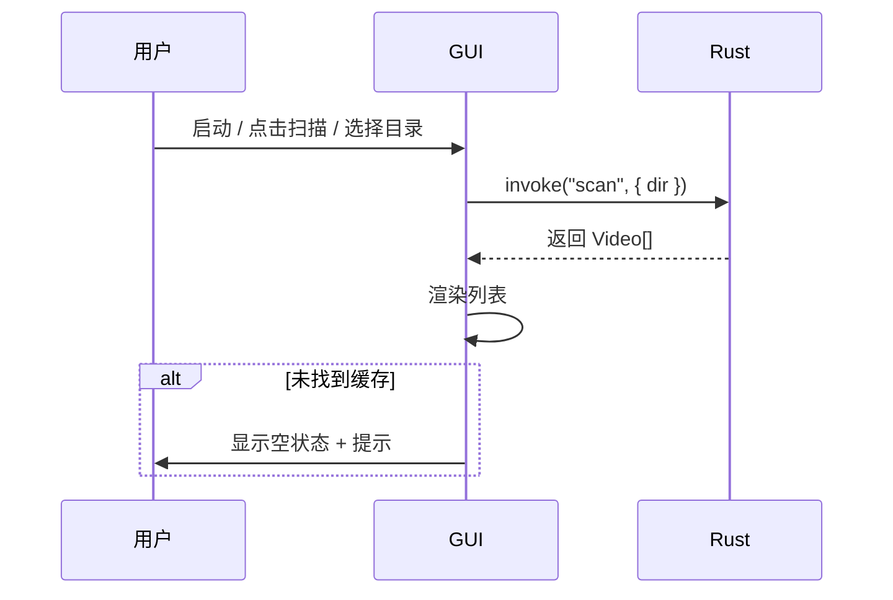
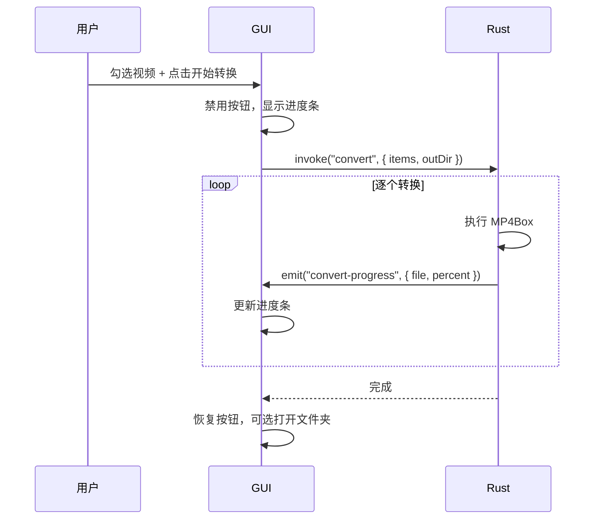

# Bili2MP4 GUI 界面设计

本文档以可视化方式描述 Bili2MP4 的图形界面设计，适用于 Tauri + Web 前端实现。

---

## 1. 主窗口整体布局

### 1.1 结构示意图

```
┌─────────────────────────────────────────────────────────────────────────────┐
│  Bili2MP4                                                    ─ □ ✕          │
├─────────────────────────────────────────────────────────────────────────────┤
│  [扫描]  [选择缓存目录]  [刷新]  │  筛选: [全部清晰度 ▾]  [🔍 搜索]           │
├─────────────────────────────────────────────────────────────────────────────┤
│ ☐ │ 标题                    │ 清晰度  │ 大小   │ 分P │ 缓存日期      │      │
│───┼────────────────────────┼────────┼────────┼─────┼───────────────┤      │
│ ☑ │ 某UP主的最新视频       │ 1080P   │ 1.2 GB │ 1/3 │ 2026-02-18     │      │
│ ☑ │ 教程：如何学习Rust     │ 720P    │ 456 MB │ 1/1 │ 2026-02-17     │      │
│ ☐ │ 娱乐向剪辑合集         │ 1080P   │ 2.1 GB │ 5/5 │ 2026-02-15     │      │
│   │                        │         │        │     │                │ 列表 │
│   │   （支持拖拽文件夹到此处）         │     │                │ 区域 │
│   │                        │         │        │     │                │      │
│   │                        │         │        │     │                │      │
│   │                        │         │        │     │                │      │
├─────────────────────────────────────────────────────────────────────────────┤
│  输出路径: [~/Movies/转换输出                    ] [浏览...]                  │
│  [开始转换]                                        [取消]                   │
│  ████████████████░░░░░░░░░░░░  转换中: 某UP主的最新视频 (2/5) 45%           │
└─────────────────────────────────────────────────────────────────────────────┘
```

### 1.2 区域划分

```mermaid
flowchart TB
    subgraph Window["主窗口 900×650"]
        subgraph Toolbar["工具栏区"]
            A1[扫描] A2[选择目录] A3[刷新] A4[筛选]
        end
        subgraph List["列表区 主区域"]
            B1[表头] B2[数据行...]
        end
        subgraph Footer["底部操作区"]
            C1[输出路径] C2[开始转换] C3[进度条]
        end
    end
```

---

## 2. 组件详细设计

### 2.1 工具栏（Toolbar）

```
┌─────────────────────────────────────────────────────────────────┐
│ [📂 扫描] [📁 选择缓存目录] [🔄 刷新]  │  筛选 [▾]  [🔍]       │
└─────────────────────────────────────────────────────────────────┘
```

| 组件 | 类型 | 说明 |
|------|------|------|
| 扫描 | 按钮 | 扫描默认缓存路径，刷新列表 |
| 选择缓存目录 | 按钮 | 打开文件夹选择器，选定后扫描 |
| 刷新 | 按钮 | 重新扫描当前缓存目录 |
| 搜索 | 输入框 | 按标题关键字过滤，200ms 防抖 |
| 筛选 | 下拉 | 根据扫描结果动态生成（1080P+、720P60、480P 等） |

### 2.2 视频列表（Table）

```
┌────┬──────────────────────┬────────┬────────┬─────┬─────────────┐
│ ☐  │ 标题                 │ 清晰度 │ 大小   │分P  │ 缓存日期    │
├────┼──────────────────────┼────────┼────────┼─────┼─────────────┤
│ ☑  │ 视频标题（可换行）   │ 1080P  │ 1.2 GB │ 1/3 │ 2026-02-18  │
└────┴──────────────────────┴────────┴────────┴─────┴─────────────┘
```

| 列 | 宽度 | 说明 |
|----|------|------|
| 复选框 | 40px | 全选/单选，支持 Shift 连续选 |
| 标题 | flex | 视频标题，超长省略，悬停显示完整 |
| 清晰度 | 80px | 1080P / 720P 等 |
| 大小 | 90px | 如 1.2 GB |
| 分P | 60px | 如 1/3 |
| 缓存日期 | 120px | YYYY-MM-DD |

**空状态示意：**

```
┌─────────────────────────────────────────┐
│                                         │
│         📂 暂无缓存视频                  │
│                                         │
│  请点击「选择缓存目录」或拖拽文件夹到此处 │
│                                         │
└─────────────────────────────────────────┘
```

### 2.3 底部操作区（Footer）

```
┌─────────────────────────────────────────────────────────────────┐
│ 输出路径  [ /Users/xxx/Movies/转换输出         ] [浏览]          │
│                                                                  │
│ [开始转换]                                    [取消]             │
│ ████████████████████░░░░░░░░  某UP主的最新视频 (2/5) 45%        │
└─────────────────────────────────────────────────────────────────┘
```

| 组件 | 类型 | 说明 |
|------|------|------|
| 输出路径 | 输入框 + 按钮 | 可编辑，浏览打开目录选择器 |
| 开始转换 | 主按钮 | 转换选中项，进行中变为「取消」 |
| 进度条 | 进度条 + 文本 | 当前文件、序号、百分比 |

**状态变化：**

- **空闲**：开始转换 可用
- **转换中**：开始转换 → 取消，进度条动画
- **完成**：恢复「开始转换」，可选 Toast 通知

---

## 3. 菜单栏

```
┌────────────────────────────────────────────────────┐
│ Bili2MP4  文件  编辑  偏好设置  帮助                │
└────────────────────────────────────────────────────┘
```

### 3.1 文件

```
┌──────────────────┐
│ 选择缓存目录      │
│ ─────────────    │
│ 退出        Cmd+Q│
└──────────────────┘
```

### 3.2 编辑

```
┌──────────────────┐
│ 全选        Cmd+A│
│ 反选   Cmd+Shift+A│
└──────────────────┘
```

### 3.3 偏好设置

```
┌──────────────────┐
│ 输出目录...       │
│ 完成后操作...     │
│ 高级选项...       │
└──────────────────┘
```

### 3.4 帮助

```
┌──────────────────┐
│ 关于 Bili2MP4    │
│ 检查更新         │
└──────────────────┘
```

---

## 4. 偏好设置弹窗

```
┌──────────────── 偏好设置 ────────────────┐
│                                          │
│  默认输出目录                             │
│  [ ~/Movies/转换输出           ] [浏览]  │
│                                          │
│  转换完成后                               │
│  ○ 无操作                                │
│  ● 打开输出文件夹                         │
│  ○ 打开并播放第一个视频                    │
│  ○ 仅弹出通知                             │
│                                          │
│  冲突处理（当输出文件已存在）              │
│  ● 覆盖  ○ 跳过  ○ 自动重命名             │
│                                          │
│              [取消]  [保存]               │
└──────────────────────────────────────────┘
```

---

## 5. 交互流程

### 5.1 扫描与加载



### 5.2 转换流程



### 5.3 拖拽指定目录


---

## 6. 视觉规范

### 6.1 尺寸建议

| 元素 | 建议值 |
|------|--------|
| 窗口最小尺寸 | 800 × 550 |
| 窗口默认尺寸 | 900 × 650 |
| 工具栏高度 | 48px |
| 表头高度 | 36px |
| 行高 | 40px |
| 底部区域高度 | 100px |
| 主按钮高度 | 36px |

### 6.2 主题

- **浅色**：背景 `#f5f5f5`，列表行 `#ffffff`，边框 `#e0e0e0`
- **深色**：背景 `#1e1e1e`，列表行 `#2d2d2d`，边框 `#404040`
- 遵循 `prefers-color-scheme` 或用户偏好

### 6.3 配色示意

```
工具栏背景    ████████  #f0f0f0 (浅) / #252525 (深)
列表表头      ████████  #e8e8e8 (浅) / #2d2d2d (深)
列表行-奇     ████████  #ffffff (浅) / #2d2d2d (深)
列表行-偶     ████████  #fafafa (浅) / #262626 (深)
主按钮        ████████  #0a84ff (蓝)
进度条        ████████  #34c759 (绿)
```

---

## 7. 异常与空状态

### 7.1 错误 Toast

```
┌────────────────────────────────────┐
│ ⚠ 转换失败：视频A - 文件不存在     │
└────────────────────────────────────┘
```

### 7.2 MP4Box 未找到

```
┌─────────────────────────────────────────────────┐
│  ⚠ 未检测到 MP4Box                               │
│                                                  │
│  请通过 Homebrew 安装：brew install gpac          │
│  或将 MP4Box 路径配置到偏好设置中。               │
│                                                  │
│                    [知道了]                       │
└─────────────────────────────────────────────────┘
```

---

*文档版本：1.1*  
*更新日期：2026-02-19*
